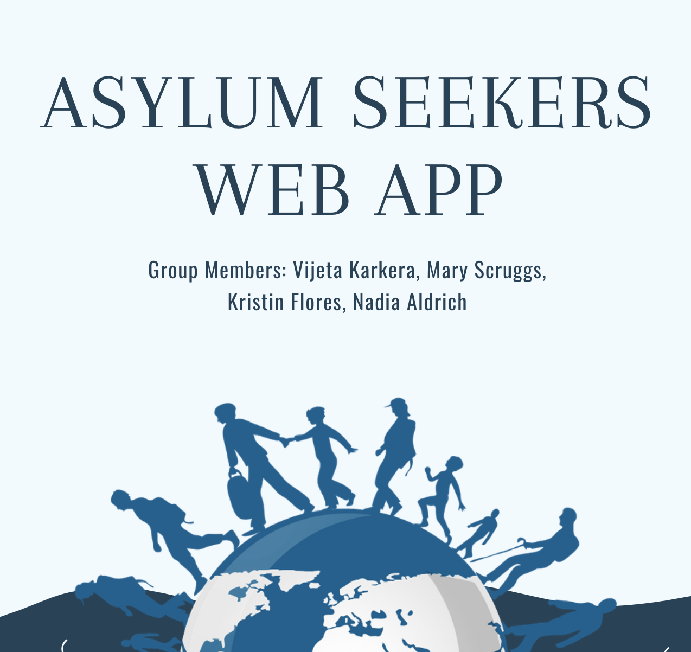

 

  

## Background:

**UNHCR**, the UN Refugee Agency, is a global organization dedicated to saving lives, protecting rights and building a better future for refugees, forcibly displaced communities and stateless people.

This agency gathers data that covers the movement of displaced persons (asylum seekers, refugees, internally displaced persons (IDP), and stateless). 

**Our goal was to create an interactive web application to help us visualize the movement of these people.** 

## Data
This dataset includes 3 csv files:

File Name | Contents
------------ | -------------
**asylumseekersmonthly.csv** | country, month, year, # of refugees
**demographics.csv** | country, total males, total females 
**coordinates_file.csv** | country, lat, long, # of refugees

## Talk about data clean up
## Obstacles?
## Demo the app 

### Created with Flask, Python 3.6 and PostGres.
Additional tools: D3.js, Plotly.js, JQuery, Leaflet, Mapbox, Javascript, Tweepy, CSS-grid.

Deployment: Heroku.

## Acknowlegdements: 
This data was downlo

